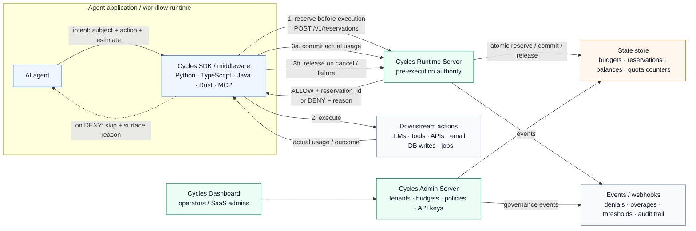

# Runcycles — Full Architecture

This is the deep-dive companion to the minimal diagram on the [org profile README](./profile/README.md). It shows the full picture: enforcement path, state store, governance plane, and event bus.

For deployment topology, configuration, and component-level docs (ports, modules, Lua scripts, key provisioning), see the [Architecture Overview](https://runcycles.io/quickstart/architecture-overview-how-cycles-fits-together) on runcycles.io.

## Full system diagram

> Works with LangGraph, CrewAI, OpenAI Agents SDK, MCP clients (Claude Desktop, Cursor, Windsurf), and custom runtimes via the SDKs.

## The key idea

Cycles is not a proxy and not a workflow engine. It does not execute tools or inspect payloads. It provides a synchronous authority check around actions that create cost, risk, or side effects.

1. **Reserve** estimated exposure before the action runs.
2. **Execute** the LLM/tool/API call only if Cycles allows it.
3. **Commit** actual usage, or **release** the reservation if the action failed or was canceled.
4. **Enforce** budgets, action policies, tenant boundaries, retries, and concurrency from one runtime control point.

## Components shown above

| Component | Role | Repo |
|---|---|---|
| **AI agent** | Your application or agent loop | — |
| **Cycles SDK / middleware** | Wraps reserve/commit lifecycle around agent calls | [Python](https://github.com/runcycles/cycles-client-python) · [TypeScript](https://github.com/runcycles/cycles-client-typescript) · [Java](https://github.com/runcycles/cycles-spring-boot-starter) · [Rust](https://github.com/runcycles/cycles-client-rust) · [MCP](https://github.com/runcycles/cycles-mcp-server) |
| **Cycles Runtime Server** | Atomic reserve/commit/release on every request | [cycles-server](https://github.com/runcycles/cycles-server) |
| **Cycles Admin Server** | Tenants, budgets, policies, API keys | [cycles-server-admin](https://github.com/runcycles/cycles-server-admin) |
| **Cycles Dashboard** | Operator UI for the admin server | [cycles-dashboard](https://github.com/runcycles/cycles-dashboard) |
| **State store** | Redis (budgets, reservations, balances, quota counters) | — |
| **Events / webhooks** | Async delivery of denials, overages, audit events | [cycles-server-events](https://github.com/runcycles/cycles-server-events) |
| **Downstream actions** | The LLMs, tools, APIs, and writes Cycles governs | — |

## Where to go next

- **Get the protocol** — [cycles-protocol](https://github.com/runcycles/cycles-protocol) for the OpenAPI spec
- **Run it** — [Deploy the Full Stack](https://runcycles.io/quickstart/deploying-the-full-cycles-stack)
- **See it stop a runaway agent** — [cycles-runaway-demo](https://github.com/runcycles/cycles-runaway-demo)
- **Component-level deep dive** — [Architecture Overview on runcycles.io](https://runcycles.io/quickstart/architecture-overview-how-cycles-fits-together) (ports, Lua scripts, auth schemes, deployment topology)
