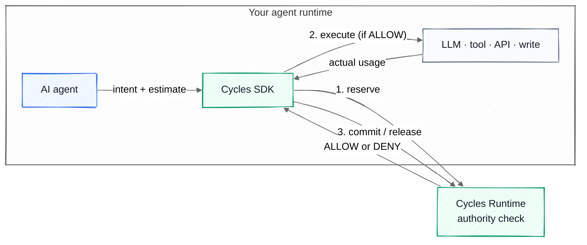

# Cycles — Runtime budget and action authority for AI agents

[](https://github.com/runcycles/.github/blob/main/LICENSE) [](https://github.com/runcycles/cycles-server/releases) [](https://github.com/runcycles/cycles-server/actions/workflows/ci.yml) [](https://github.com/runcycles/cycles-server/blob/main/cycles-protocol-service/pom.xml) [](https://scorecard.dev/viewer/?uri=github.com/runcycles/cycles-server) [](https://www.bestpractices.dev/projects/12734)

**Open-source enforcement layer for AI agent governance: hard limits on cost, risk, and tool actions before LLM agents execute.** Multi-tenant, concurrency-safe, and self-hostable. SDKs for Python, TypeScript, Rust, and Spring Boot; MCP server for Claude Desktop, Cursor, and Windsurf.

- **What** — a protocol-level runtime that enforces `reserve → execute → commit / release` on every AI agent call, preventing runaway spend, unauthorized tool actions, and tenant boundary violations before they happen.
- **Who** — AI platform teams, agent framework builders, and SaaS operators running autonomous LLM agents in production. Production-grade for OpenAI, Anthropic, MCP, OpenAI Agents SDK, LangChain, and CrewAI workloads.
- **Why** — rate limits and dashboards observe failure after the fact. Cycles prevents it — by making cost and action authority a property of the runtime, not the application.

👉 **Start with [Cycles Docs](https://runcycles.io)** · **[Protocol Spec](https://github.com/runcycles/cycles-protocol)** · **[Reference Server](https://github.com/runcycles/cycles-server)** · **[Runaway Demo](https://github.com/runcycles/cycles-runaway-demo)**

---

## Architecture at a glance



The agent declares intent, the SDK reserves with the Cycles runtime, executes only if allowed, then commits actual usage or releases the reservation. Cycles is a synchronous authority check — not a proxy, not a workflow engine.

> Want the full picture (admin server, dashboard, state store, events)? See **[ARCHITECTURE.md](https://github.com/runcycles/.github/blob/main/ARCHITECTURE.md)**.

---

## See it stop a runaway agent


A runaway agent racks up ~$10 in 12 seconds with no enforcement. The same agent under Cycles stops at the budget limit — $1.00. Full demo: **[cycles-runaway-demo](https://github.com/runcycles/cycles-runaway-demo)**.

---

## Try it

### MCP — zero code (Claude Desktop, Claude Code, Cursor, Windsurf)

Add to your `claude_desktop_config.json` (or equivalent):

```json
{
  "mcpServers": {
    "cycles": {
      "command": "npx",
      "args": ["-y", "@runcycles/mcp-server"],
      "env": { "CYCLES_MOCK": "true" }
    }
  }
}
```

`CYCLES_MOCK=true` runs against an in-process mock so you can try it without deploying the server. Swap for `CYCLES_BASE_URL` + `CYCLES_API_KEY` to point at a real Cycles deployment. Full setup: **[cycles-mcp-server](https://github.com/runcycles/cycles-mcp-server)**.

### Python — decorator on your existing LLM calls

```bash
pip install runcycles
```

```python
from runcycles import CyclesClient, CyclesConfig, set_default_client, cycles

set_default_client(CyclesClient(CyclesConfig.from_env()))

@cycles(estimate=1000, action_kind="llm.completion", action_name="gpt-4")
def summarize(text: str) -> str:
    return openai.chat.completions.create(...)  # your existing LLM call
```

The `@cycles` decorator reserves budget before the function runs, commits actuals on return, and releases on exception. Set `CYCLES_BASE_URL`, `CYCLES_API_KEY`, and `CYCLES_TENANT` in your env.

Other SDKs: **[TypeScript](https://github.com/runcycles/cycles-client-typescript)** · **[Spring Boot / Java](https://github.com/runcycles/cycles-spring-boot-starter)** · **[Rust](https://github.com/runcycles/cycles-client-rust)**.

---

## Start here

New to Cycles? Start with the protocol, then choose the implementation surface you need.

### Core Platform
- [docs](https://github.com/runcycles/docs) — documentation site (runcycles.io) with quickstarts, integration guides, and protocol reference
- [cycles-protocol](https://github.com/runcycles/cycles-protocol) — protocol definitions, semantics, and API contract
- [cycles-server](https://github.com/runcycles/cycles-server) — reference enforcement server for reservations, commits, releases, and balances
- [cycles-server-admin](https://github.com/runcycles/cycles-server-admin) — tenant, budget, API key, funding, and audit management
- [cycles-server-events](https://github.com/runcycles/cycles-server-events) — asynchronous webhook /event dispatch with HMAC signing, retry, and pluggable transports
- [cycles-dashboard](https://github.com/runcycles/cycles-dashboard) — Operational admin UI for the Cycles budget governance platform

### Client SDKs
- [cycles-spring-boot-starter](https://github.com/runcycles/cycles-spring-boot-starter) — easiest way to integrate Cycles into Spring AI / Java apps
- [cycles-client-python](https://github.com/runcycles/cycles-client-python) — integrate Cycles budget and risk control into Python apps
- [cycles-client-typescript](https://github.com/runcycles/cycles-client-typescript) — budget and risk control for Node.js / Vercel AI / LangChain/ OpenAI
- [cycles-client-rust](https://github.com/runcycles/cycles-client-rust) — integrate Cycles budget and risk control into Rust AI agents

### Integrations & Examples
- [cycles-mcp-server](https://github.com/runcycles/cycles-mcp-server) — MCP server that gives AI agents runtime budget control — reserve, commit, and release
- [cycles-openai-agents](https://github.com/runcycles/cycles-openai-agents) — Budget, risk and runtime authority for the OpenAI Agents SDK
- [cycles-openclaw-budget-guard](https://github.com/runcycles/cycles-openclaw-budget-guard) — OpenClaw plugin for budget-aware model and tool execution
- [cycles-spring-ai-starter](https://github.com/runcycles/cycles-spring-ai-starter) — Budget, risk and runtime authority for Spring AI Agents (ChatClient)
- [langchain-runcycles](https://github.com/runcycles/langchain-runcycles) — LangChain agent middleware, pre-tool-call authorization, per-tenant budget enforcement
- [integration-examples-py](https://github.com/runcycles/cycles-client-python/tree/main/examples) — Integration examples (Python): OpenAI, Anthropic, LangChain, FastAPI
- [integration-examples-ts](https://github.com/runcycles/cycles-client-typescript/tree/main/examples) — Integration examples (TypeScript): LangChain.js, Vercel AI, AWS Bedrock, Google

### Demos
- [cycles-runaway-demo](https://github.com/runcycles/cycles-runaway-demo) — self-contained demo showing a runaway agent failure mode and Cycles stopping it
- [cycles-agent-action-authority-demo](https://github.com/runcycles/cycles-agent-action-authority-demo) — self-contained demo of blocking unapproved tool calls with Cycles

---

## Why Cycles exists

Autonomous systems do not fail like traditional software. They loop, retry, fan out across tools and models, continue after partial failure, and create costs and side effects that are difficult to predict.

Traditional controls — rate limits, timeouts, quotas — manage **velocity**. They do not reliably bound **total exposure**. Cycles is the runtime layer that does.

## What this is

**Cycles** is an open, language-agnostic protocol for deterministic exposure accounting in autonomous systems. It defines reserve → commit / release semantics, hierarchical scopes, idempotency under retries, and shadow evaluation before hard enforcement.

**Runcycles** is the production implementation: a runtime that enforces Cycles semantics over real failure modes — long-running agent loops, tool-calling workflows, retries, crashes, and concurrency.

Think of it as a **budget authority for autonomous execution**: the layer that decides whether an action may proceed, how much exposure to reserve for it, and how that usage is reconciled afterward. Not a billing dashboard, not a workflow engine, not a rate limiter.

## How it works

The diagram above shows the synchronous loop. In one sentence: the SDK reserves estimated exposure with the Cycles runtime *before* the agent's action runs, executes only on `ALLOW`, then commits actual usage or releases the reservation.

This makes it possible to stop work before budgets are exceeded, avoid double-spend under retries, reconcile actual vs estimated usage, enforce limits across parent and child scopes, and run policies in shadow before blocking production traffic.

## What Cycles enforces

- **Deterministic reserve → commit control** — reserve before execution, commit actual usage after, release on cancel or under-spend
- **Hierarchical budgeting** across `tenant / workspace / app / workflow / agent / toolset` scopes, with inherited parent limits
- **Idempotency under retries and concurrency** — duplicate requests, worker crashes, partial retries, delayed commits all behave correctly
- **Shadow mode and progressive rollout** — simulate and tune policies before turning on hard enforcement
- **Failure-aware enforcement** — designed for systems where crashes and partial completion are normal

## Who it's for

Teams building autonomous systems that can create meaningful cost, side effects, or operational risk:

- **AI platform teams** enforcing tenant and workload budgets
- **Agent developers** building looped or tool-calling workflows
- **Spring AI / JVM teams** adding hard budget limits to production
- **SaaS operators** needing multi-tenant usage isolation
- **Gateway builders** adding reservation and commit semantics to AI traffic

It governs anything that creates cost, risk, or irreversible side effects — LLM and inference calls, external APIs, database writes, message dispatch, payments, deployments, workflow fan-out.

Use it when you need hard spend boundaries, pre-execution budget checks, retry-safe accounting, tenant-aware limits, hierarchical policy control, or progressive rollout from shadow to enforcement. **If all you need is request throttling or usage analytics, Cycles is not the right tool.**

## What Cycles is not

- a billing system
- a token or rewards engine
- an observability-only dashboard
- an agent framework
- a generic workflow scheduler
- an AI safety silver bullet

Its purpose is specific: **make autonomous exposure explicit, bounded, and enforceable.**

## Design principles

- **account before enforce**
- **reserve before execute**
- **commit actuals, release remainder**
- **make retries safe**
- **keep the protocol independent of the runtime**
- **support shadow mode before hard stops**
- **treat side effects as governable exposure**

## Status

Cycles is under active development. The protocol is stabilizing through real implementation work and will evolve with strong compatibility discipline as it moves toward v1. See [CHANGELOG.md](https://github.com/runcycles/cycles-server/blob/main/CHANGELOG.md) on `cycles-server` for the current release cadence.

## Learn more

- **[runcycles.io](https://runcycles.io)** — full documentation, API reference, integration guides
- [Cycles Manifesto](./MANIFESTO.md) — the longer "why"
- [ARCHITECTURE.md](https://github.com/runcycles/.github/blob/main/ARCHITECTURE.md) — full system diagram with admin server, dashboard, state store, and event bus

If you're building autonomous systems and need deterministic control over exposure, Cycles is the runtime layer for that job.
